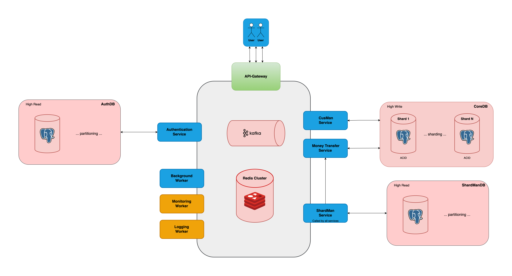

# Simple Bank - Microservices Architecture - Docker Deployment

This project implements the server-side of a simple banking system using a microservices architecture. It provides core banking functionalities such as customer and account management, secure authentication, money transfers, notifications, and monitoring capabilities.

Note: Loan and saving features are planned for future development.

## Banking Service Description
The banking system is divided into multiple services to ensure scalability, security, and high performance. The main services include:



### 1. Shard Management Service
Responsible for allocating and managing customer data across different shards to optimize performance and scalability.

- **Customer Registration:** When a new customer registers, the system creates and stores **(customer_id, shard_id)** to determine the appropriate data shard for storage.
- **Account Creation:** When a customer creates a new account, the system generates and stores **(account_id, shard_id)** to assign the account to the correct shard.

### 2. Customer Management Service
Handles customer information and account management.

- **Customer Registration:** Creates a new customer profile in the system, with a background process to send an email verification request.
- **Account Creation:** Allows registered customers to open new bank accounts.

### 3. Authentication Service
Manages customer login credentials and session handling.

- **Customer Credential Creation:** Allows customers to create login credentials, including usernames and passwords.
- **Login and Session Management:** Provides secure login functionality and maintains active sessions for a seamless experience.

### 4. Money Transfer Service
Handles internal and interbank money transfer transactions.
- **Account Checking:** Check and get account info serve for transactions.
- **Money Transfer:** Ensures secure, consistent, and efficient money transfers between accounts or banks.

### 5. Background Worker
Processes asynchronous tasks to improve system efficiency.

- **Email Verification:** Sends verification emails to customers as part of the registration process.
- **Transaction Notifications:** Automatically sends transaction confirmation emails to customers after each money transfer.

## Tech Stack (for Docker deployment)

+ **Architecture:** Microservices, Service-Oriented Architecture (SOA).

+ **Languages:** Golang.

+ **DB:** PosgreSQL (partitioning, sharding).

+ **APIs:** RESTful (client-to-service), gRPC ( service-to-service).

+ **Build/Test/Deployment:** Docker (docker file, docker build), Docker Compose, Unittest, K6 (performance testing), Kubernetes (k8s).

+ **Advanced Techs:** JWT/Paseto (authentication/security), Kafka (message queue), Redis (caching), Logging and monitoring.

## Main objective:: Processing large scale money transfers.
### Solution 1 (Naive): Single PostgreSQL Instance (ACID for money transfer transactions).
- **Limitations?** Vertical scaling only (limited by hardware capacity).
- **When to Use?** Solution 1 is viable for moderate traffic (<40k TPS).

### Solution 2 (Improvement): Horizontal Scaling with DB Sharding (ACID per shard) + Eventual Consistency.
- **Scalability? Unlimited scalability** by distributing data across multiple database shards.
- **Performance Expectation?** Each shard is expected to handle a stable throughput of approximately 25k TPS.

- **How It Works?**
  - Customer and their accounts data are partitioned into the same shard, ensuring that each shard only processes a subset of transactions.
  - Each shard maintains **full ACID compliance**, ensuring data integrity within its scope.
  - **Eventual consistency** is applied at a global level to maintain overall system coherence across multiple shards.
- **When to Use?**
- **Essential for high-scale systems** where transaction throughput exceeds 50k TPS.
- Recommended for **continuous growth**, as new shards can be added dynamically to handle increasing demand.


## Detailed Solution 2: Cross-Shard Money Transfer Simulation (A → B)
This approach simulates a money transfer transaction between two database instances (shards) while ensuring consistency and recoverability.

### Step 1: Persist Transaction Data (Kafka)
1. **Generate unique transaction IDs:**
  - `sending_transaction_id` (for source account).
  - `receiving_transaction_id` (for destination account).
2. **Store transaction details in Kafka**, including:
  - `sending_tran_id`, `receiving_tran_id`, `amount`, `currency_type`, `src_acc_number`, `src_acc_shard_id`, `bene_acc_number`, `bene_acc_shard_id`.
  - This ensures the transaction is **persisted before execution**, preventing data loss.
### Step 2: Deduct Funds from Source Account (Shard A)
1. Deduct the amount from the source account and create sending_transaction_hist:
```sql
UPDATE accounts SET balance = balance - amount WHERE id = source_id;
...
```
2. Send request to Shard B (Destination Account) for crediting funds.
### Step 3: Deduct Funds from Source Account (Shard A)
1. Credit funds to the destination account and create receiving_transaction_hist:
```sql
UPDATE accounts SET balance = balance + amount WHERE id = destination_id;
...
```
2. Notify user about transaction status.

### Step 4: Background Worker for Final Verification
- Periodically verifies transactions using sending_transaction_id & receiving_transaction_id with their shard_id.
- If both transactions are SUCCESS, no action needed.
- If one or both transactions failed, retry mechanism is triggered to rollback data.

### Why Is This Approach Reliable?

✅ **Prevents data loss** → Kafka ensures transaction persistence before execution.

✅ **Ensures strong consistency** → Background worker verifies final transaction states.

✅ **Provides automatic recovery** → Rollback mechanisms ensure data integrity.

## Docker Deployment - Quick Start Guide
### Configuration Requirements
To deploy the service, you need to prepare:

1. **Service Configuration File:**
    - `config.env`: Contains specific configuration details for the service (e.g., database credentials, secret keys, ports, etc.).
    - This file is **not baked into the Docker image for security reasons**.
    - You must mount the `config.env` file into the container at runtime (using `docker-compose` or `docker run`).

2. **Docker Environment Configuration File:**
    - `.env`: Used for general Docker Compose settings (such as network configuration, volume paths, image versions, etc.).

---

📩 Contact me to get sample configuration files tailored for your environment:
```graphql
Email: tunv.todo@gmail.com
Telegram: @tu7568
```
---


### Docker Deployment Steps
1. Clone the project:
```bash
  git clone https://github.com/tunvx/simple-bank
```

2. Add the following records to your host file:
```bash
  ### CONFIG INGRESS FOR MAC: Add to etc/hosts
  127.0.0.1 auth.banking.local
  127.0.0.1 cusman.banking.local
  127.0.0.1 moneytransfer.banking.local
  127.0.0.1 shardman.banking.local
```

3. Start core banking services (database, Redis, Kafka, etc.):
```bash
  make clear-infra
  make network
  make volume
  make start-infra
  make start-services
```

4. Then, try to test service via your browser by URL:
```bash
  http://auth.banking.local/v1/generate_test_access_token
```

5. Start the monitoring services (Prometheus, Grafana, etc.):
```bash
  make start-monitor
```

### Docker Monitoring Steps
After deploy monitor, do the following steps:
+ Login to grafana ( admin : abc13579 )
+ Connections -> Add a new connection -> Find and enter "Prometheus" -> Add a new data source -> Enter "http://prometheus:9090" into "Prometheus server URL" -> Save and Test
+ Dashboards -> New -> Import -> Enter "1860" and "193" ID (for node-exporter and cadvisor) -> Select data source is "prometheus" -> Import -> You can see defaul dashboards -> Save

### Testing Result (Performance)
**Load testing results with K6 (100 VU for 3 minutes)**

| No. | Framework | Test              | Duration (min) | Total Requests (req) | HTTP RPS (req/s)  | Avg Latency (ms) | Min Latency (ms) | Max Latency (ms) | P95 Latency (ms) |
|-----|-----------|-------------------|----------------|-----------------------|------------------|------------------|------------------|------------------|------------------|
| 1   | Raw       | Empty GET         | 3              | -                     | *                | -                | -                | -                | -                |
| 2   | Raw       | Empty POST        | 3              | -                     | *                | -                | -                | -                | -                |
| 3   | gRPC      | Empty GET         | 3              | 7,351,829             | **40,772**       | 2.44             | 0.096            | 4010            | 1.43             |
| 4   | gRPC      | Empty POST        | 3              | 6,833,348             | **37,941**       | 2.62             | 0.092            | 1400             | 1.61              |
| 5   | gRPC      | Check Account     | 3              | 4,100,233             | **22,765**       | 4.38             | 0.196            | 1400           | 4.01            |
| 6   | gRPC      | Transfer Money    | 3              | 679,187               | **3,772**        | 26.49            | 1.50             | 721.19           | 39.15            |


Refer to the `docs` folder for details (experiment and analyze results):
```bash
  https://github.com/tunvx/simple-bank/blob/main/docs/performance-testing.md

  https://github.com/tunvx/simple-bank/tree/main/testing/performance_testing_results
```

## Deploy to Kubernetes

## Documentation
After deploy, refer to the `swagger docs` for each service:

```bash
  http://shardman.banking.local/docs/
  
  http://auth.banking.local/docs/
  
  http://cusman.banking.local/docs/
  
  http://moneytransfer.banking.local/docs/
```

## Appendix

### Techniques tags 
The tags I read this while doing this project. I make notes of them because I think it's useful to learn about
+ _ monolithic, microservice, SOA, distributed systems, golang.
+ _ design_database, db_nomalization, db_indexes, db_migration (sqlc), transaction, ACID, consistency_locking.
+ _ RESTful, gRPC, HTTP/1.1, HTTP/2, RPC, HTTPS, SSL/TLS.
+ _ token_based_authentication, JWT, Paseto, session_management, access_control.
+ _ unittest, performance_test, load_testing, k6.
+ _ containerization, docker, dockerfile, docker_compose, kubernetes (k8s).
+ _ redis, kafka, message_queue, background_worker, asynchronous_communication, asynchronous_processing, caching, logging, monitoring, alerting, metrics collection.


