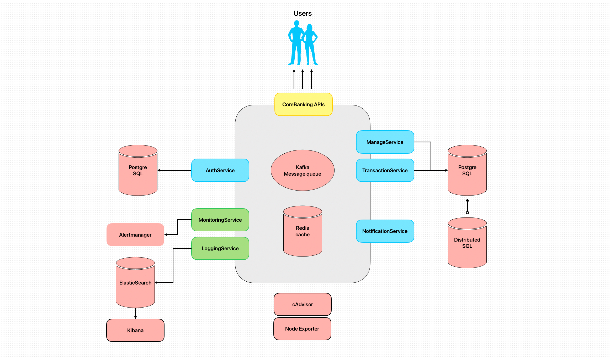

# Simple Bank (Serve-Side)

This project implements the server-side of a simple banking system. It leverages a microservices architecture to deliver a range of banking functionalities, including customer and account management, secure authentication, money transfer transactions, notifications, historical data management, logging, and monitoring.

Note: Loan and savings features are planned for future releases.

**Banking System Architecture:**

### Banking service description
+ Customer Registration: Allows new customers to register, with a background process for email verification.
+ Customer Credential Creation: Manages secure creation and storage of customer login credentials.
+ Account Creation: Enables customers to create and manage their bank accounts with ease.
+ Money Transfer Transactions: Support secure, consistent and efficient money transfers between accounts.
+ Notification service: Support notification to customer's email after each transaction or send verification email.

## Tech Stack

**Architecture:** Microservice, SOA.

**Languages:** Golang.

**DB:** PosgreSQL, Cassandra.

**APIs:** RESTful (client-to-service), gRPC ( service-to-service).

**Build/Test/Deployment:** CI/CD, GitHub Actions, unit tests, performance tests, Docker Compose.

**Advantage Techs:** JWT/Paseto (web security), Kafka (message queue), Redis (caching), logging, and monitoring.

**Future Additional Techs:** Distributed SQL, Docker Swarm/Kubernetes for auto-scaling.

## Appendix

### Techniques tags 
The tags I read this while doing this project. I make notes of them because I think it's useful to learn about
+ _ monolithic, microservice, SOA, distributed systems, golang.
+ _ design_database, db_nomalization, db_indexes, db_migration (sqlc), transaction, ACID, consistency_locking.
+ _ RESTful, gRPC, HTTP/1.1, HTTP/2, RPC, HTTPS, SSL/TLS.
+ _ token_based_authentication, JWT, Paseto, session_management, access_control.
+ _ unittest, performance_test, load_testing, k6.
+ _ docker, docker_compose, dockerfile, containerization.
+ _ redis, kafka, message_queue, background_worker, asynchronous_communication, asynchronous_processing, caching, logging, monitoring, alerting, metrics collection.