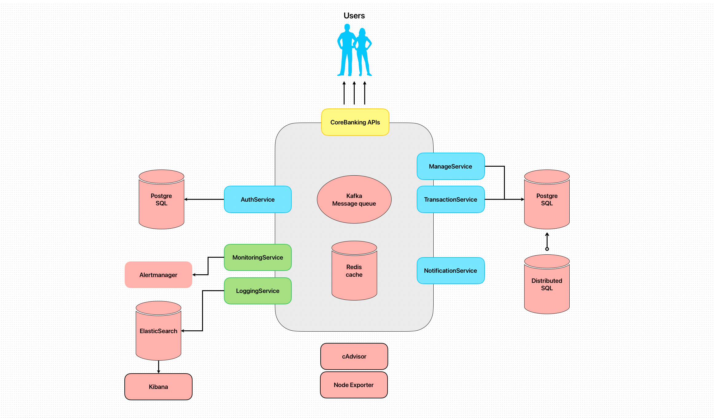

# Simple Bank - Microservices Architecture - Docker Deployment

This project implements the server-side of a simple banking system using a microservices architecture. It provides core banking functionalities such as customer and account management, secure authentication, money transfers, notifications, and monitoring capabilities.

Note: Loan and saving features are planned for future development.

**Banking System Architecture:**



### Description of banking service
1. **Manage Service**
  + Customer Registration: Allows new customers to register, with a background process to send email verification.
  + Account Creation: Allows customers to create thier accounts.
2. **Auth Service**
+ Customer Credential Creation: Allows customers to create login credentials.
+ Login and Session Management: Provides secure login functionality and session management.
3. **Transaction Service**
+ Money Transfer Transactions: Support secure, consistent and efficient money transfers between accounts.
4. **Notification Service**
- Email Verification: Sends verification emails to customers as part of the registration process.
- Transaction Notifications: Sends email notifications to customers after each transaction.

## Tech Stack (for Docker deployment)

+ **Architecture:** Microservices, Service-Oriented Architecture (SOA).

+ **Languages:** Golang.

+ **DB:** PosgreSQL.

+ **APIs:** RESTful (client-to-service), gRPC ( service-to-service).

+ **Build/Test/Deployment:** Docker (docker file, docker build), Docker Compose, Unittest, K6 (performance testing).

+ **Advanced Techs:** JWT/Paseto (authentication/security), Kafka (message queue), Redis (caching), Logging and monitoring.

## Docker Deployment - Quick Start Guide
### Deployment Steps
1. Clone the project:
```bash
  git clone https://github.com/tunvx/simple-bank
```

2. Navigate to the project directory:
```bash
  cd simple-bank
```

3. Switch to the docker-deploy branch:
```bash
  git checkout docker-deploy
```

4. Navigate to the `domolo` directory (short for docker + monitoring + logging):
```bash
  cd domolo
```

5. Start core banking services (database, Redis, Kafka, etc.):
```bash
  make start-infra
```

6. Start the monitoring services (Prometheus, Grafana, etc.):
```bash
  make start-monitor
```

### Monitoring Steps
After deploy monitor, do the following steps:
+ Login to grafana ( admin : abc13579 )
+ Connections -> Add a new connection -> Find and enter "Prometheus" -> Add a new data source -> Enter "http://prometheus:9090" into "Prometheus server URL" -> Save and Test
+ Dashboards -> New -> Import -> Enter "1860" and "193" ID (for node-exporter and cadvisor) -> Select data source is "prometheus" -> Import -> You can see defaul dashboards -> Save

## Testing and Performance Results
Refer to the testing folder for details:
```bash
  cd testing
```

## Appendix

### Techniques tags 
The tags I read this while doing this project. I make notes of them because I think it's useful to learn about
+ _ monolithic, microservice, SOA, distributed systems, golang.
+ _ design_database, db_nomalization, db_indexes, db_migration (sqlc), transaction, ACID, consistency_locking.
+ _ RESTful, gRPC, HTTP/1.1, HTTP/2, RPC, HTTPS, SSL/TLS.
+ _ token_based_authentication, JWT, Paseto, session_management, access_control.
+ _ unittest, performance_test, load_testing, k6.
+ _ containerization, docker, dockerfile, docker_compose, kubernetes (k8s).
+ _ redis, kafka, message_queue, background_worker, asynchronous_communication, asynchronous_processing, caching, logging, monitoring, alerting, metrics collection.

